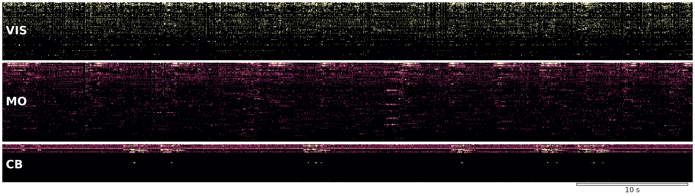

# DECOMP



Cross-region shared-subspace analysis on the IBL Brain-Wide Map (2023_12 release), asking
whether movement-correlated activity in mouse visual cortex, motor cortex, and cerebellum
reflects **one global low-dimensional state inherited everywhere** or **distinct
region-specific computations** that just happen to correlate at the population level.

## What we're studying

Stringer et al. (2019) and the IBL Brain-Wide Map (2025) both report that movement variables
are decodable from neurons essentially everywhere in the mouse brain. Decoding accuracy
alone cannot say whether that ubiquity reflects one inherited signal or many distinct
computations — only **shared-subspace structure** can. We test that across three region
pairs (V1↔CB, V1↔M1, CB↔M1) on 15 simultaneous dual-region recordings, partial out
movement covariates at two granularities, and probe the lag and task-locking of the
residual.

The full result is in [`docs/expansion_analysis.md`](docs/expansion_analysis.md). One-liner:
the three pairs reach similar partial-CCA survival ratios but through different mechanisms —
V1↔CB looks like global state we still don't measure, V1↔M1 like shared task-related state,
CB↔M1 like real cerebellothalamocortical transmission with a measurable +40 ms lead.

## Install

```bash
conda env create -f environment.yaml
conda activate decomp
```

ONE public auth (no Alyx account needed, IBL well-known token):
```python
from one.api import ONE
one = ONE(base_url='https://openalyx.internationalbrainlab.org', password='international')
```
ONE cache lives at `~/Downloads/ONE/`. The full expansion run uses ~5 GB.

## Run the pipeline

The main entry point runs the full multi-pair analysis end-to-end:

```bash
PYTHONPATH=src python run_all.py \
    --pairs "VIS:CB,VIS:MO,CB:MO" \
    --max-pair 10 --max-pool 10 \
    --n-components 8 --n-surrogates 200
```

Stage-resume from cache (e.g., after data download has completed):
```bash
PYTHONPATH=src python run_all.py --rerun-from svca
```

The two follow-up analyses reuse cached SVCA scores and binned covariates and run in
~1 minute each:

```bash
# Richer-Z stress test (5–6-D Z: + whisker ME, body ME, lick rate, wheel acc)
PYTHONPATH=src python scripts/run_richz.py

# Lag + task-locking analysis on residual canonical variates
PYTHONPATH=src python scripts/run_dynamics.py
```

Re-render all figures from cache without recomputing:
```bash
PYTHONPATH=src python scripts/render_figures.py
```

Smoke test on already-cached sessions:
```bash
PYTHONPATH=src python run_all.py --max-pair 3 --max-pool 3 --n-surrogates 50
```

## Analyses supported

| Analysis | Stage | Output |
|---|---|---|
| Per-neuron Ridge GLM with raised-cosine kernels, leave-one-group-out ΔR² | `decomp.glm` | `outputs/fig01_glm_dr2_per_region.png` |
| Within-region SVCA (Stringer 2019), K = 8 components | `decomp.svca` | per-pair `reliability.png` figures + `outputs/reliability_aggregated.png` |
| Cross-region canonical correlations with phase-shuffle null | `decomp.cca.run_cca` | `outputs/correlations_aggregated.png` |
| Partial CCA (Frisch–Waugh–Lovell residualisation) under Z = wheel + pupil | `decomp.cca.pcca` | `outputs/survival.png` |
| Richer-Z stress test (Z = wheel, wheel-acc, whisker ME, body ME, pupil, lick rate) | `decomp.cca.richz` | `outputs/richz_comparison.png` |
| Residual canonical-variate dynamics: cross-correlation function + peri-event averages | `decomp.cca.dynamics` | `outputs/dynamics.png` |

Synthetic-data unit tests (math regression, no IBL access required):
```bash
PYTHONPATH=src python -m pytest tests/test_synthetic.py -v
```

## Documentation

| Document | Topic |
|---|---|
| [`docs/data.md`](docs/data.md) | IBL BWM 2023_12 access, ROI definitions, session funnel, per-pair coverage |
| [`docs/mvp_conclusion.md`](docs/mvp_conclusion.md) | Frozen MVP record (3-session V1↔CB analysis) |
| [`docs/expansion_analysis.md`](docs/expansion_analysis.md) | **Main results**: 7 sections + 6 figures, current state of the analysis |
| [`docs/tools.md`](docs/tools.md) | Reusable IBL / SVCA / CCA / pCCA tooling notes |

## Layout

```
src/decomp/
├── data/         # IBL data access, session selection, spike + covariate binning
├── glm/          # Per-neuron Ridge GLM with raised-cosine kernels + ΔR²
├── svca/         # Within-region SVCA via neuropop
├── cca/          # CCA, partial CCA, phase-shuffle nulls, richer-Z, residual-variate dynamics
├── viz/          # Matplotlib figure factory
├── analysis/     # Auto-interpretation utilities
└── pipeline/     # Stage orchestrators (data → GLM → SVCA → CCA → pair runner)

run_all.py             Main pipeline entry point
scripts/run_richz.py   Richer-Z stress test (reuses cache)
scripts/run_dynamics.py Lag + task-locking on residual canonical variates (reuses cache)
scripts/render_figures.py  Re-render all figures from cache
scripts/check_run.sh   Detached-run monitoring helper
```

The `decomp` package is pip-installable in editable mode (handled by `environment.yaml`).

## Key references

- IBL et al. *Nature* 2025 — A brain-wide map of neural activity during complex behaviour.
- Stringer et al. *Science* 2019 — Spontaneous behaviors drive multidimensional brainwide activity.
- Wang, Kurgyis & Druckmann *Nat Neurosci* 2026 — Brain-wide movement encoding structured
  across and within brain areas.
- Musall et al. *Nat Neurosci* 2019 — Single-trial neural dynamics dominated by movements.
- Semedo et al. *Neuron* 2019 — Cortical areas interact through a communication subspace.

## License

MIT — academic course project. IBL data is governed by the IBL data-sharing agreement.
