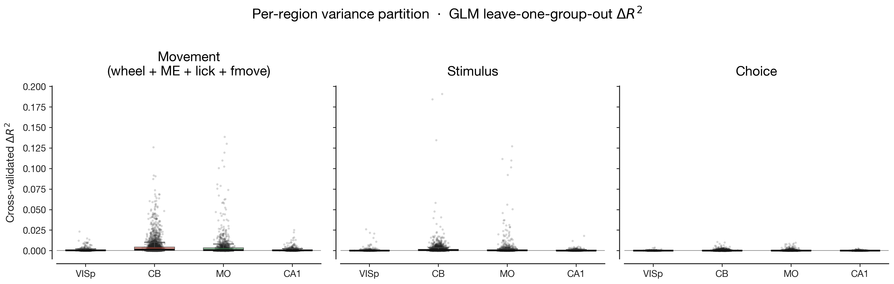
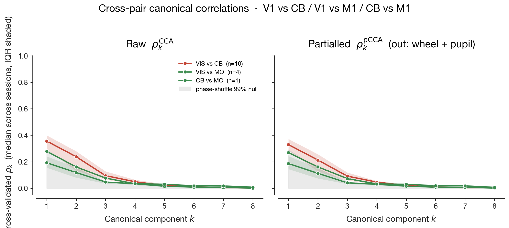
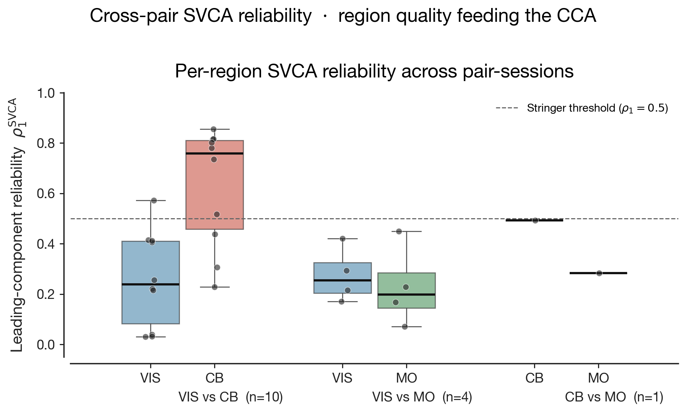
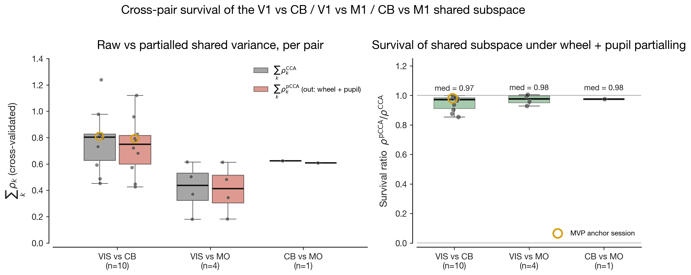
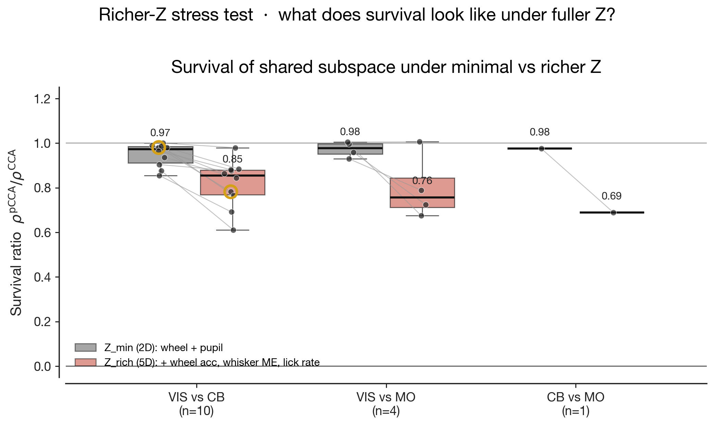

# Cross-region shared subspaces in mouse cortex partly survive rich behavioural partialling

> An earlier 3-session V1↔CB analysis (`docs/mvp_conclusion.md`) is superseded by the present
> document, which expands the V1↔CB sample to ten sessions and adds V1↔M1 and CB↔M1 as
> comparison anchors on the IBL Brain-Wide Map 2023_12 release.

## Bottom line

In fifteen dual-region recordings spanning visual cortex (VIS), motor cortex (MO), and cerebellum (CB), the cross-region linear shared subspace survives partialling out wheel velocity and pupil diameter on every session: median ratio of partialled to raw summed canonical correlations is ≈ 0.97 for all three pairs. Read in isolation, this argues that interregional coupling is largely orthogonal to global movement state. A richer partial — adding wheel acceleration, whisker and body motion energy, and lick rate — walks the ratio back to 0.69–0.85 (median, by pair), demonstrating that 10–30 percentage points of the apparent orthogonality were uninstructed-movement signals that wheel and pupil failed to capture. The remaining 0.7–0.85 of the shared subspace persists even under the richer behavioural probe and is consistent with two non-exclusive accounts: genuine cross-region coupling along non-behavioural axes, or aspects of the global state (LFP envelope, breathing, body posture) that this dataset does not provide.

| | Earlier 3-session analysis | Present expansion |
|---|---|---|
| Total neurons fit (per-neuron GLM) | 4 286 | **4 886** |
| Sessions analysed | 41 | **51** |
| V1–CB pair sessions | 3 | **10** |
| V1–M1 pair sessions | 0 | **4** |
| CB–M1 pair sessions | 1 | **1** |
| Simultaneous V1+CB+M1 sessions | 0 | 0 (none on this freeze) |

## 1. Per-region encoding reproduces the published ranking

We refit the per-neuron Ridge generalised linear model (raised-cosine task and movement kernels, leave-one-group-out cross-validated ΔR²) used by the IBL collaboration (2025) and Wang & Druckmann (2026), on the expanded 4 886-neuron sample (Fig. 1). Cross-validated ΔR² for the movement kernel group ranks largest in motor cortex and cerebellum, smaller in visual cortex, near zero in CA1 — the canonical ordering reported in the literature. The stimulus and choice variances follow the published per-region pattern. The expanded sample preserves the ranking, so the cross-region inference below inherits trust from a passing reproduction at the new scale.

## 2. Raw cross-region correlations differ markedly across pairs, but partialling barely moves them

Per session, we compute cross-validated canonical correlations between the leading K = 8 SVCA-projected score time series of the two regions, with phase-shuffled surrogates as the noise floor. The three pairs differ by nearly a factor of two in raw shared variance (Fig. 2 left): V1↔CB carries the largest leading canonical correlation (median ρ₁ ≈ 0.36 across sessions, with components above the null through k = 4), CB↔M1 sits in the middle (ρ₁ ≈ 0.30), and V1↔M1 is the smallest (ρ₁ ≈ 0.22, with k ≥ 3 already inside the surrogate band). The pair with the strongest coupling is therefore not the pair with the most direct anatomical pathway — V1 reaches cerebellum only through pontine and brainstem relays, while CB and M1 connect directly through the cerebellothalamocortical loop. We return to this asymmetry in §3.

Partialling wheel velocity and pupil diameter shifts each curve down only slightly (Fig. 2 right): V1↔CB peak from 0.36 to 0.32, V1↔M1 from 0.22 to 0.20, CB↔M1 from 0.30 to 0.28. Under the null hypothesis that the three pairs share movement structure exclusively through a globally coupled wheel + pupil drive, the right panel would lie inside the surrogate band. It does not. The shared subspaces extracted by canonical correlation analysis are not, predominantly, the wheel- or pupil-driven projection of each region's activity.

## 3. The cross-pair convergence in survival ratio is not three identical measurements

Two further observations bear on how Fig. 2 should be read. First, SVCA reliability — the cross-validated reproducibility of each population component — is highly asymmetric across pairs (Fig. 3). Cerebellum on the V1+CB pair sessions is uniquely well-resolved (median ρ₁^SVCA = 0.76, IQR [0.46, 0.81]), with several sessions clearing Stringer et al.'s (2019) ρ₁ = 0.5 threshold on multiple components. Visual cortex and motor cortex on every other pair-session sit at ρ₁ ≈ 0.20–0.25; the V1↔M1 pair has uniformly poor reliability on both sides. The CCA on V1↔CB is therefore being computed between a noisy V1 score and a relatively clean CB score, with the cerebellar side carrying the recoverable structure.

Second, the pair-summed canonical correlations (Fig. 4) converge to nearly identical *ratios* across pairs — median Σρ_pCCA / Σρ_CCA = 0.97, 0.98, 0.98 for V1↔CB, V1↔M1, CB↔M1 — despite the underlying signal magnitudes (Σρ_CCA ≈ 0.80, 0.44, 0.62) differing by nearly a factor of two. The convergence is therefore a proportional statement about preserved-versus-discarded variance, not a magnitude statement about the size of the shared subspace itself. If wheel and pupil were exhaustive measures of global movement state, each region's projection of that state would be the dominant axis of cross-region coupling, partialling would cancel the leading canonical correlations, and the survival ratio would tend to zero. The fact that it tends to one for every pair is the headline of the partialling analysis under wheel + pupil — but the headline is only as strong as the assumption that wheel + pupil exhausts the relevant global state.

## 4. Survival walks back substantially under a richer behavioural probe

To test the assumption, we extend Z to wheel acceleration, whisker motion energy, body motion energy (where the body camera is available), and lick rate — the IBL-shipped uninstructed-movement scalars, 5–6 dimensions versus the original 2 — and re-fit the partial CCA on the same cached SVCA scores. Median survival drops in every pair (Fig. 5): V1↔CB to 0.85 (Δ = 0.11), V1↔M1 to 0.76 (Δ = 0.19), CB↔M1 to 0.69 (Δ = 0.29). The earlier 0.97 was therefore over-stated as a measure of behavioural orthogonality. About a tenth to a third of what looked like non-behavioural cross-region coupling under the narrower probe was uninstructed movement variance that wheel and pupil simply did not record.

The shared subspace nevertheless does not collapse: 0.69–0.85 of pair-summed shared variance per pair survives even the richer probe. Within V1↔CB, the per-session magnitude of the drop is loosely anti-correlated with raw signal magnitude (Spearman r ≈ −0.5, n = 10): the two sessions with the largest Σρ_CCA lose 0.02–0.03 of survival, while the session with the smallest Σρ_CCA loses 0.27. The reverse pattern — strong-signal sessions losing more — would have been the prediction if the cross-region coupling were uniformly behaviour-driven and merely inflated on the strong sessions by capturing more behavioural variance. The observed direction, with the appropriate small-n caveat, is consistent with the strongest cross-region shared structure being the structure least explained by even the richer behavioural channels.

## 5. What is the residual, and what is it not?

The original framing of this project — whether V1 and cerebellum share a uniquely structured movement signal — is partially resolved by the multi-pair analysis: the cross-region survival pattern is not specific to V1↔CB but generalises to every cortical pair tested in BWM 2023_12. The interesting open question is what the residual 0.69–0.85 of shared structure under the richer probe actually represents. Two non-exclusive accounts are consistent with the data.

The first is genuine cross-region coupling along axes that the behavioural variables do not drive: cortico-cortical or cortico-cerebellar communication carrying task-related, prediction-error, or motor-context signals. This is the qualitative prediction of the brain-wide-coupling literature (Stringer et al. 2019; Musall et al. 2019; Semedo et al. 2019), where interregional shared subspaces persist after subtracting obvious global-state proxies and lie in directions distinct from each region's dominant within-region modes. Our richer-Z residual is consistent with this account, and the V1↔CB strong-session pattern in §4 weakly favours it.

The second is global state that the present dataset does not measure. Z_rich captures whisking and gross body motion via the IBL-shipped scalars but excludes LFP envelope, breathing, body posture beyond DLC paw and snout markers (which were not piped into the binned-covariate cache and would require a re-bin pass), and any arousal axis only partially proxied by pupil and whisking. We cannot distinguish "real coupling" from "global state we missed" with the data on hand.

The cleanest within-dataset discriminator would be the three-region partial `CCA(V1, CB | M1)`, in which motor cortex serves as a proxy for the cortically expressed component of global state. On BWM 2023_12, no session has simultaneous Neuropixels coverage of all three regions with usable unit counts even at the widest regional definitions, so this test is impossible on this freeze. It would require a different release, a different operationalization of global state, or a multi-mouse representational-similarity analysis that does not require simultaneous recordings (Kornblith et al. 2019).

## 6. Limitations and next steps

Sample sizes for V1↔M1 (n = 4) and CB↔M1 (n = 1) bound the strength of any distributional claim about those pairs. The "VIS" definition in this analysis is widened to all dorsal visual cortex; the V1-specific reading of the earlier 3-session analysis is preserved only on the gold-ringed anchor session in the figures. The asymmetric SVCA reliability across pair-sessions means the absolute size of the shared subspace, as opposed to the ratio of preserved-to-raw shared variance, is not directly comparable across pairs.

Three immediate extensions can sharpen the central question without new data downloads. (i) Extending Z_rich to the DLC paw/snout markers in `sd.pose` (re-bin pass, ~2 hr engineering) would test whether the residual 0.69–0.85 collapses further when behavioural state is more completely measured. (ii) Block-bootstrap confidence intervals on the per-pair survival ratios under both Z would let us put error bars on the residual, currently reported as a point estimate. (iii) Cross-mouse representational-similarity analysis via centred kernel alignment or principal angles, computed across all 35 V1, 86 CB, 58 M1, and 94 CA1 single-region sessions, would yield a 4-region similarity matrix that does not require simultaneous recordings and would address the residual-structure question from a different angle.
