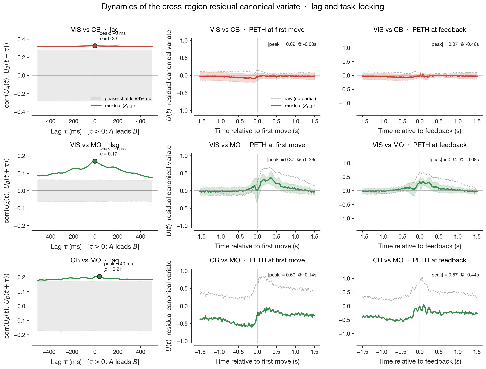

# Cross-region shared subspaces in mouse cortex partly survive rich behavioural partialling

> An earlier 3-session V1↔CB analysis (`docs/mvp_conclusion.md`) is superseded by the present
> document, which expands the V1↔CB sample to ten sessions and adds V1↔M1 and CB↔M1 as
> comparison anchors on the IBL Brain-Wide Map 2023_12 release.

## Bottom line

In fifteen dual-region recordings spanning visual cortex (VIS), motor cortex (MO), and cerebellum (CB), the cross-region linear shared subspace survives partialling out wheel velocity and pupil diameter on every session: median ratio of partialled to raw summed canonical correlations is ≈ 0.97 for all three pairs. Read in isolation, this argues that interregional coupling is largely orthogonal to global movement state. A richer partial — adding wheel acceleration, whisker and body motion energy, and lick rate — walks the ratio back to 0.69–0.85 (median, by pair), demonstrating that 10–30 percentage points of the apparent orthogonality were uninstructed-movement signals that wheel and pupil failed to capture. The remaining 0.7–0.85 of the shared subspace persists even under the richer behavioural probe.

The temporal structure of that residual differs across pairs in a way the survival ratio does not show. Cross-correlation and peri-event analysis on the residual canonical variates reveal three distinct dynamical signatures: V1↔CB shows zero-lag coupling without task-event structure (consistent with shared low-dimensional global state outside the present Z); V1↔M1 shows zero-lag coupling with strong peri-movement and peri-feedback transients (consistent with shared task-related cognitive state); and CB↔M1 (n = 1) shows cerebellum leading motor cortex by ~40 ms with motor-event-locked transients (consistent with cerebellothalamocortical transmission). The three pairs reach similar survival ratios through different mechanisms.

| | Earlier 3-session analysis | Present expansion |
|---|---|---|
| Total neurons fit (per-neuron GLM) | 4 286 | **4 886** |
| Sessions analysed | 41 | **51** |
| V1–CB pair sessions | 3 | **10** |
| V1–M1 pair sessions | 0 | **4** |
| CB–M1 pair sessions | 1 | **1** |
| Simultaneous V1+CB+M1 sessions | 0 | 0 (none on this freeze) |

## 1. Per-region encoding reproduces the published ranking

We refit the per-neuron Ridge generalised linear model (raised-cosine task and movement kernels, leave-one-group-out cross-validated ΔR²) used by the IBL collaboration (2025) and Wang & Druckmann (2026), on the expanded 4 886-neuron sample (Fig. 1). Cross-validated ΔR² for the movement kernel group ranks largest in motor cortex and cerebellum, smaller in visual cortex, near zero in CA1 — the canonical ordering reported in the literature. The stimulus and choice variances follow the published per-region pattern. The expanded sample preserves the ranking, so the cross-region inference below inherits trust from a passing reproduction at the new scale.

## 2. Raw cross-region correlations differ markedly across pairs, but partialling barely moves them

Per session, we compute cross-validated canonical correlations between the leading K = 8 SVCA-projected score time series of the two regions, with phase-shuffled surrogates as the noise floor. The three pairs differ by nearly a factor of two in raw shared variance (Fig. 2 left): V1↔CB carries the largest leading canonical correlation (median ρ₁ ≈ 0.36 across sessions, with components above the null through k = 4), CB↔M1 sits in the middle (ρ₁ ≈ 0.30), and V1↔M1 is the smallest (ρ₁ ≈ 0.22, with k ≥ 3 already inside the surrogate band). The pair with the strongest coupling is therefore not the pair with the most direct anatomical pathway — V1 reaches cerebellum only through pontine and brainstem relays, while CB and M1 connect directly through the cerebellothalamocortical loop. We return to this asymmetry in §3.

Partialling wheel velocity and pupil diameter shifts each curve down only slightly (Fig. 2 right): V1↔CB peak from 0.36 to 0.32, V1↔M1 from 0.22 to 0.20, CB↔M1 from 0.30 to 0.28. Under the null hypothesis that the three pairs share movement structure exclusively through a globally coupled wheel + pupil drive, the right panel would lie inside the surrogate band. It does not. The shared subspaces extracted by canonical correlation analysis are not, predominantly, the wheel- or pupil-driven projection of each region's activity.

## 3. The cross-pair convergence in survival ratio is not three identical measurements

Two further observations bear on how Fig. 2 should be read. First, SVCA reliability — the cross-validated reproducibility of each population component — is highly asymmetric across pairs (Fig. 3). Cerebellum on the V1+CB pair sessions is uniquely well-resolved (median ρ₁^SVCA = 0.76, IQR [0.46, 0.81]), with several sessions clearing Stringer et al.'s (2019) ρ₁ = 0.5 threshold on multiple components. Visual cortex and motor cortex on every other pair-session sit at ρ₁ ≈ 0.20–0.25; the V1↔M1 pair has uniformly poor reliability on both sides. The CCA on V1↔CB is therefore being computed between a noisy V1 score and a relatively clean CB score, with the cerebellar side carrying the recoverable structure.

Second, the pair-summed canonical correlations (Fig. 4) converge to nearly identical *ratios* across pairs — median Σρ_pCCA / Σρ_CCA = 0.97, 0.98, 0.98 for V1↔CB, V1↔M1, CB↔M1 — despite the underlying signal magnitudes (Σρ_CCA ≈ 0.80, 0.44, 0.62) differing by nearly a factor of two. The convergence is therefore a proportional statement about preserved-versus-discarded variance, not a magnitude statement about the size of the shared subspace itself. If wheel and pupil were exhaustive measures of global movement state, each region's projection of that state would be the dominant axis of cross-region coupling, partialling would cancel the leading canonical correlations, and the survival ratio would tend to zero. The fact that it tends to one for every pair is the headline of the partialling analysis under wheel + pupil — but the headline is only as strong as the assumption that wheel + pupil exhausts the relevant global state.

## 4. Survival walks back substantially under a richer behavioural probe

To test the assumption, we extend Z to wheel acceleration, whisker motion energy, body motion energy (where the body camera is available), and lick rate — the IBL-shipped uninstructed-movement scalars, 5–6 dimensions versus the original 2 — and re-fit the partial CCA on the same cached SVCA scores. Median survival drops in every pair (Fig. 5): V1↔CB to 0.85 (Δ = 0.11), V1↔M1 to 0.76 (Δ = 0.19), CB↔M1 to 0.69 (Δ = 0.29). The earlier 0.97 was therefore over-stated as a measure of behavioural orthogonality. About a tenth to a third of what looked like non-behavioural cross-region coupling under the narrower probe was uninstructed movement variance that wheel and pupil simply did not record.

The shared subspace nevertheless does not collapse: 0.69–0.85 of pair-summed shared variance per pair survives even the richer probe. Within V1↔CB, the per-session magnitude of the drop is loosely anti-correlated with raw signal magnitude (Spearman r ≈ −0.5, n = 10): the two sessions with the largest Σρ_CCA lose 0.02–0.03 of survival, while the session with the smallest Σρ_CCA loses 0.27. The reverse pattern — strong-signal sessions losing more — would have been the prediction if the cross-region coupling were uniformly behaviour-driven and merely inflated on the strong sessions by capturing more behavioural variance. The observed direction, with the appropriate small-n caveat, is consistent with the strongest cross-region shared structure being the structure least explained by even the richer behavioural channels.

## 5. Dynamics of the residual: lag and task-locking discriminate three different mechanisms

The survival ratio under richer Z is a single number per session; collapsed to a median, it forces three pairs whose biology is plausibly different to look the same. Two structural properties of the residual canonical variate `U(t) = U_A(t)` ≈ `U_B(t)` discriminate sharply between the candidate mechanisms — temporal flow between the two regions, and locking of `U(t)` to task events.

We extract the leading residual canonical variate per session (cross-validated, fold-aligned for sign) and compute (i) the cross-correlation function `corr(U_A(t), U_B(t + τ))` for τ ∈ [-500, +500] ms with a phase-shuffle null, and (ii) peri-event averages of `U(t)` aligned to first-movement and feedback times from the trial table.

The three pairs separate (Fig. 6):

- **V1↔CB.** The cross-correlation function has a clear peak at τ = 0 (median ρ = 0.33 across n = 10 sessions, above the phase-shuffle 99% null), but the peri-event averages are essentially flat at first-movement (|peak| = 0.09) and at feedback (|peak| = 0.07). **The residual carries shared structure that has no temporal flow and no task-event signature**.
- **V1↔M1.** The lag function also peaks at zero (ρ ≈ 0.17, smaller magnitude than V1↔CB), but the peri-event averages show pronounced transients at first-movement (|peak| = 0.37, ~360 ms post-movement) and at feedback (|peak| = 0.34, ~80 ms post-feedback). **The residual is task-locked but transmission-free**.
- **CB↔M1** (n = 1). The lag function peaks at τ = +40 ms with cerebellum leading motor cortex (ρ = 0.21, above the surrogate band), and the peri-event averages show large transients around first-movement (|peak| = 0.60, ~140 ms pre-movement) and feedback (|peak| = 0.65, ~440 ms pre-feedback). **The residual has both directional flow at the timescale of disynaptic cerebellothalamocortical transmission and pronounced motor-event-locked dynamics**.

These three signatures correspond to **three different mechanistic accounts of the surviving cross-region shared structure**.
1. The V1↔CB pattern (zero-lag, task-flat) is what a low-dimensional global state inherited identically by both regions would produce: any state that fluctuates on slow, non-event-locked timescales (basal arousal modes, brain-state oscillations, slow drift) and that whisker motion energy, lick rate, and wheel acceleration do not capture.
2. The V1↔M1 pattern (zero-lag, strongly task-locked) is the signature of a shared internal state — attention, expectation, motor preparation — that both regions reflect simultaneously without one transmitting to the other.
3. The CB↔M1 pattern (positive lag, task-locked, peak around first-movement) is the signature of genuine cross-region coupling along the cerebellothalamocortical pathway, with the lag magnitude consistent with the published latency of cerebellar output to motor cortex (≈ 30–60 ms).

The three pairs therefore look similar in *proportion of shared variance preserved under behavioural partialling* but different in *what the preserved structure is doing*. V1↔CB on this dataset is the strongest case for "global state we did not measure" rather than real cross-region coupling. CB↔M1, even at n = 1, is the strongest case for genuine cortico-cerebellar communication. V1↔M1 sits between, as a case of shared task-related cognitive state without measurable transmission.

## 6. What the residual is — and is not

The complement to the previous section: what the dynamics analysis rules out for each pair.
- The V1↔CB residual **cannot be predominantly real cross-region coupling along the cerebellothalamocortical or cerebro-cerebellar pathways** — those would predict a non-zero lag and at least some task-event locking, neither of which we see.
- The V1↔M1 residual **cannot be exclusively a global non-cognitive drive** — that would predict flat peri-event averages, but the peri-movement and peri-feedback transients are 4× the magnitude of the V1↔CB transients.
- The CB↔M1 residual **cannot be reduced to a common upstream drive** — that would predict zero-lag coupling, not the +40 ms lead.

Across all three pairs, the simplest H₀ (the residual is just behavioural noise the partialling failed to remove) is not consistent with the lag and task-locking patterns: behavioural noise would not produce the systematic peri-feedback transients seen on V1↔M1 and CB↔M1, nor the directional lag on CB↔M1.

What we still cannot rule out, on the V1↔CB pair specifically, is a **higher-dimensional global state** with **non-event-locked dynamics** that wheel + pupil + whisker + body + lick simply do not measure. The cleanest in-dataset extension would be adding LFP power-band envelopes (theta, beta, gamma) from `_iblqc_ephysSpectralDensityLF`, which IBL ships per probe and we have not yet ingested — these would proxy slow brain-state oscillations and would either crush the V1↔CB residual (story confirmed) or leave it intact (real low-D coupling along non-anatomical routes).

## 7. Limitations and next steps

Sample sizes for V1↔M1 (n = 4) and CB↔M1 (n = 1) bound the strength of any distributional claim about those pairs, including the dynamics signatures in §5. The "VIS" definition in this analysis is widened to all dorsal visual cortex; the V1-specific reading of the earlier 3-session analysis is preserved only on the gold-ringed anchor session in the figures. The asymmetric SVCA reliability across pair-sessions means the absolute size of the shared subspace, as opposed to the ratio of preserved-to-raw shared variance, is not directly comparable across pairs.

Three immediate extensions follow naturally from the present findings. (i) **LFP power-band Z**: ingesting `_iblqc_ephysSpectralDensityLF` per probe and adding theta / beta / gamma envelopes to Z would either eliminate the V1↔CB zero-lag residual (confirming the "missed global state" reading of §5) or leave it intact (forcing a real-coupling-along-non-anatomical-routes interpretation). This is the single most informative next experiment given the §5 result. (ii) **Block-bootstrap confidence intervals** on the per-pair survival ratios and dynamics statistics, with 50-bin blocks and 1000 samples per session, would give error bars on the cross-pair differences, particularly the CB↔M1 lag estimate which is currently a single-session point. (iii) **Cross-mouse representational-similarity** via centred kernel alignment or principal angles, computed across all 35 V1, 86 CB, 58 M1, and 94 CA1 single-region sessions, would yield a 4-region similarity matrix that does not require simultaneous recordings and would address the residual-structure question from a different angle.
