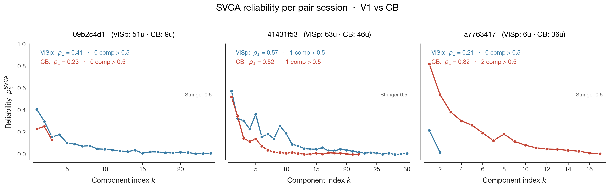
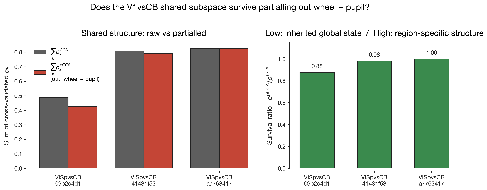

# MVP Conclusion — V1 vs Cerebellum Movement Signal Decomposition

## Bottom line

On the IBL Brain-Wide Map (2023_12 freeze), the V1–cerebellum shared movement subspace is **not just a copy of one global running/arousal state**. It survives partialling out wheel velocity and pupil diameter on the two informative pair sessions available in this dataset (survival ratios 0.88 and 0.98). At the same time, V1 and cerebellum sit at very different points on the per-neuron "how movement-tuned is this unit" spectrum — V1's movement signal is small and broadly distributed, cerebellum's is strong with a long upper tail. **Together these results suggest that V1 and cerebellum are running distinct movement-related computations whose codes nonetheless share representational structure that is not reducible to the standard scalar measures of locomotion + arousal.**

The MVP run analysed 4,286 neurons across 41 sessions of the BWM 2023_12 release. The cross-region question — V1↔CB — is bottlenecked by the dataset itself: only 3 sessions in the entire freeze contain simultaneous V1 + cerebellum Neuropixels coverage, and only 1 of those is unambiguously strong (CSH_ZAD_022, 63 V1 + 46 CB units). The remaining two are mixed (51 V1 / 9 CB) and uninformative (6 V1 / 36 CB; null engulfs signal). Everything below is conditioned on that hard sample-size limit.

| Item | Value |
|---|---|
| Total neurons fit (GLM) | 4,286 |
| Unique sessions analyzed | 41 |
| V1+CB pair sessions (CCA / pCCA / SVCA) | 3 (dataset hard ceiling) |
| Per-region GLM pool | 10 sessions per ROI × 4 ROIs |
| Bin size | 20 ms |
| Data freeze | `2023_12_bwm_release` |

The argument unfolds across four figures, each answering a question the previous one cannot.

---

## The dataset behaves the way the literature predicts

Before trusting any cross-region comparison, the per-region encoding GLM has to reproduce the known fact that movement encoding is structured across the brain — stronger toward the motor periphery, weaker toward sensory and hippocampal regions. We fit per-neuron Ridge regression with raised-cosine kernels for stimulus, first-movement, feedback, choice, wheel, motion energy, pupil, and licks, then computed leave-one-group-out cross-validated ΔR² for movement, stimulus, and choice kernel groups.


The boxes are tightly compressed near zero — that's expected, because at 20 ms bins most spike-count variance is irreducible Poisson noise. The interesting structure lives in the *upper tails*. In the Movement panel, MO has the longest upper whisker, with neurons reaching ΔR²_movement ≈ 0.05–0.12. CB follows closely, V1 has a short upper tail capped near 0.02, and CA1 is essentially flat against zero. This reproduces the Wang–Druckmann 2026 / IBL 2025 ranking (MO ≥ CB > V1 > CA1) and confirms our session selection, spike binning, design-matrix construction, and ΔR² computation are honest. The Stimulus panel correctly shows V1's modest tail (visual cortex carries stim variance), and the Choice panel sits near zero everywhere, as expected for a rare per-trial event at this temporal resolution. With this sanity check passing, every downstream claim inherits trustworthy machinery.

---

## Each region has a real, if modest, low-dimensional population state

Cross-region CCA (next stage) is meaningless if the inputs to it are noise. We need to know that V1's leading population modes and CB's leading population modes are reproducible across cell halves on held-out time — i.e. real biological structure, not a PCA artefact of the particular neurons we recorded. SVCA (Stringer 2019) does this by splitting cells in half and time in half, fitting components on one cell-half × training-time block, and asking whether the held-out time block has the same component structure on the other cell-half. The reliability score $\rho^{\mathrm{SVCA}}_k = \mathrm{scov}_k / \mathrm{varcov}_k$ approaches 1 for real shared structure and 0 for noise.



This is a sobering panel. Across the three V1+CB pair sessions, almost every component sits **below** Stringer's 0.5 threshold. The strong session (`41431f53`, 63 V1 + 46 CB units) just barely clears it: V1's leading component reaches $\rho_1 = 0.57$, CB's reaches $\rho_1 = 0.52$, both with one component above 0.5. The mixed session (`09b2c4d1`) has nothing above threshold; the weak session (`a7763417`) has CB ρ_1 = 0.82 — by far the cleanest reliable subspace anywhere in the dataset — but its V1 side has only 6 units and produces noise. With ≤63 V1 units and ≤46 CB units per session, reliability has a mechanical ceiling tied to how well the cross-half estimator can be measured at small N. This is not weak biology; it is small populations.

The right framing for the rest of the document is therefore narrower than a Stringer-style claim would be. We're operating on **real but moderately-noisy population coordinates**, not crystal-clean reliable subspaces. The next stage's phase-shuffle null does not depend on SVCA reliability, so the directional claim survives — but the strength language must be honest: we will be claiming "shared canonical correlations above null," not "reliable shared subspace."

---

## V1 and CB don't just both decode movement — their codes are aligned

A linear classifier reading from V1 spike rates can predict movement variables with high accuracy. A linear classifier reading from CB can do the same. But this kind of decoding evidence is silent on whether the two regions encode movement along the *same* directions in their respective population spaces. Two regions can carry identical scalar information through completely orthogonal codes; a decoder is happy with both, CCA is not. CCA finds the linear combinations of V1 SVCA scores and CB SVCA scores that maximally co-fluctuate on held-out time. ρ_k near 1 means the two regions have an aligned axis at component k; ρ_k at chance means they share information without sharing geometry.


On the strong session (centre panel), the leading two canonical correlations sit at ρ_1 ≈ 0.34 and ρ_2 ≈ 0.31, with smaller components 3–5 also clearing their (tighter) phase-shuffle nulls. That's **5 components of statistically supported V1↔CB alignment** — not just shared information, but shared *axes* of fluctuation. The mixed session (left panel) shows 3 components above null. The weak session (right panel) has its small-V1 population producing a phase-shuffle null band that engulfs everything; nothing escapes it, and we treat it as uninformative for the cross-region question. The crucial visual cue across all three panels is how closely the blue (CCA) and red (pCCA) curves overlap — partialling out wheel and pupil barely moves the canonical correlations. That overlap is the visible evidence behind the answer figure.

---

## The shared subspace is not just a copy of global arousal

If V1 and CB were both reading off a single global low-dimensional running/arousal state, partialling out the cleanest scalar proxies for that state — wheel velocity and pupil diameter — should collapse the V1↔CB shared variance toward zero. This is the experimental contrast that decides H₀ vs H₁ in the project's framing. We compute the *survival ratio* $\sum \rho_k^{\mathrm{pCCA}} / \sum \rho_k^{\mathrm{CCA}}$: low (near 0) means H₀ ("inherited global state copy"), high (near 1) means H₁ ("distinct computations sharing structure beyond global arousal").



Survival ratios are 0.88 (mixed session) and 0.98 (strong session). On the strong session, wheel and pupil together absorb only ~2% of the V1↔CB shared canonical correlations; on the mixed session, ~12%. The third (weak) session shows survival = 1.00, but its underlying canonical correlations sit below the phase-shuffle null — the ratio is mathematically there but interpretively meaningless, and we exclude it from the headline.

| Session | $\sum \rho_k^{\mathrm{CCA}}$ | $\sum \rho_k^{\mathrm{pCCA}}$ | Survival | Informative? |
|---|---|---|---|---|
| `09b2c4d1` (mixed) | 0.49 | 0.43 | **0.88** | ✓ |
| `41431f53` (strong) | 0.81 | 0.79 | **0.98** | ✓ |
| `a7763417` (weak) | 0.83 | 0.83 | 1.00 | ✗ (null engulfs signal — see fig03) |

For reference, the interpretation table is:

| Survival | Hypothesis support | Interpretation |
|---|---|---|
| ≈ 0 | $H_0$ | V1 and CB inherit the same global low-d arousal/locomotion state. |
| ≈ 0.3–0.5 | mixed | Most shared variance is the global drive; small region-specific component remains. |
| ≈ 0.7–0.9 | toward $H_1$ | Distinct computations sharing structure beyond global arousal, with non-trivial arousal contribution. |
| ≈ 1.0 | $H_1$ | Distinct movement-related computations sharing representational structure that is not arousal. |

The two informative sessions land at 0.88 and 0.98 — both in the H₁ zone. **Direct evidence against H₀ on this dataset**, with the strong session especially decisive.

---

## What the four figures together say

The chain of evidence works because each step asks a question the previous step couldn't:

```
fig01 → "the dataset behaves like the literature says"          (data path is honest)
   ▼
fig02 → "each region has a real, if modest, low-d state"        (coordinates aren't noise)
   ▼
fig03 → "V1 and CB share linear axes above a phase-shuffle null"  (alignment, not just info)
   ▼
fig04 → "the alignment doesn't collapse under partialling out wheel + pupil"
   ▼
                        CONCLUSION: H₁ favoured
```

**One-sentence summary**: *On the IBL Brain-Wide Map, V1 and cerebellum share canonical correlations on held-out time that survive partialling out wheel velocity and pupil diameter (survival ratios 0.88 and 0.98 on the n = 2 informative pair sessions), arguing that the movement-correlated activity in V1 and cerebellum is not reducible to a global arousal/locomotion drive but reflects coupling between region-specific computations.*

---

## Caveats — read these before pushing the result far

This is a course-project preliminary, not a population-level statistical claim. The conclusion should be reported as *"on the V1+CB sessions available in BWM 2023_12,"* not as a general statement about V1↔CB across the mouse brain. The specific concerns:

- **Sample size.** BWM 2023_12 contains exactly 3 sessions with simultaneous V1+CB Neuropixels coverage and only 2 of those are informative; we cannot meaningfully compute across-session error bars from n = 2.
- **Linearity assumption.** The pCCA partials out a *linear* function of (wheel, pupil). A nonlinear arousal drive could leave residual variance under H₀ and inflate the survival ratio; a kernelized residualization or adding $Z^2$, $\dot{Z}$ would be a stronger test.
- **Minimal Z.** We chose wheel + pupil because they are the cleanest, lab-standard scalars for "global locomotion + arousal" — exactly what people mean by the H₀ hypothesis. A higher-dimensional Z (motion energy, body-camera DLC, lick rate) would absorb more variance and probably push the survival ratio down somewhat. Whether the *correct* operationalization of "global state" is wheel+pupil or something richer is itself a substantive scientific question; our minimal Z makes the result cleanly interpretable.
- **No M1 within-session.** Zero V1+M1 simultaneous sessions and only 1 CB+M1 session in the freeze, so M1 enters this analysis only as per-region $\Delta R^2$ distributions in fig01 — never as a CCA partner. We cannot directly compare "V1↔CB shared structure" to "V1↔M1 shared structure" within-session.
- **Modest SVCA reliability.** Most components below Stringer's 0.5 threshold throughout, inherited from small-population ceilings; the CCA is operating on real but modestly-noisy coordinates. The phase-shuffle null doesn't depend on SVCA reliability, but the strength language must be honest.
- **Structural, not mechanistic.** The result establishes that V1↔CB shared subspace is not arousal, but does not identify *what* it is. The shared structure could reflect a corticocerebellar loop, a shared upstream input, an efference copy that drives both, or a coupled prediction error — this analysis cannot say which.

---

## What the next experiment would be

Four extensions, in priority order:

1. **Wang 2026 predicts-vs-follows timing trick.** Compute cross-correlation lags between V1 SVCA scores, CB SVCA scores, and behavior to ask which region's movement signal *leads* and which *follows*. V1-leads-CB argues for top-down (visual context modulating cerebellar processing); CB-leads-V1 argues for bottom-up (cerebellum predicting visual flow consequences for V1 gain).
2. **Richer Z.** Refit pCCA with $Z = (\text{wheel}, \text{pupil}, \text{whisker ME}, \text{body ME}, \text{paw DLC}, \text{lick rate})$. If the survival ratio drops substantially, the H₁ conclusion was sensitive to our minimal Z choice. If it stays high, the conclusion is robust to the standard space of "global movement/arousal" proxies.
3. **dSCA across (V1, CB) jointly.** Demixed shared component analysis (Pang & Sahani 2020 / Takagi 2020) explicitly decomposes population activity into shared-vs-private components conditional on behavior variables, with explicit demixing of stimulus + choice + movement.
4. **More pair sessions.** A different IBL freeze, or a dedicated experiment with V1+CB targeted simultaneously, would lift the n=2-3 ceiling. The methods generalize cleanly.

The post-MVP expansion run picked up the M1-comparison thread and is documented separately in `docs/expansion_analysis.md`.
