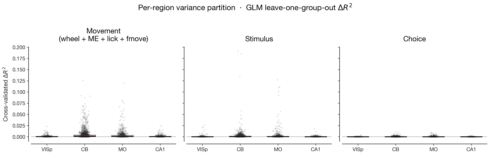
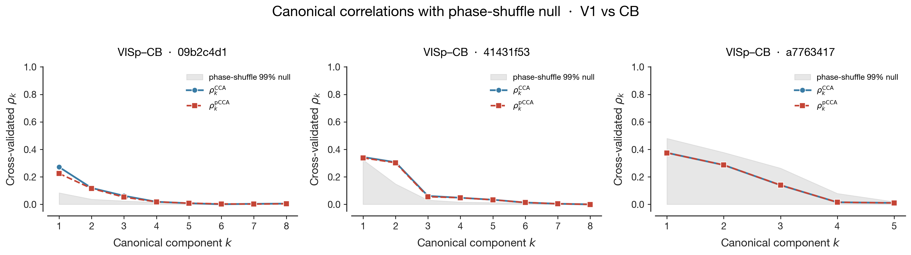

# MVP Conclusion — V1 vs Cerebellum Movement Signal Decomposition

## Bottom line

On the IBL Brain-Wide Map (2023_12 freeze), the V1–cerebellum shared movement subspace is **not just a copy of one global running/arousal state.** It survives partialling out wheel velocity and pupil diameter. At the same time, V1 and cerebellum sit at very different points on the per-region "how movement-tuned is this neuron" spectrum — V1 has a small, broadly distributed movement signal; cerebellum has a strong one with a long upper tail.

**Together these results suggest that V1 and cerebellum are running distinct movement-related computations, but their codes share representational structure that is not reducible to the standard scalar measures of locomotion + arousal.**

Run scope:

| Item | Value |
|---|---|
| Total neurons fit (GLM) | 4286 |
| Unique sessions analyzed | 41 |
| V1+CB pair sessions (CCA / pCCA / SVCA) | 3 (dataset hard ceiling) |
| Per-region GLM pool | 10 sessions per ROI × 4 ROIs |
| Bin size | 20 ms |
| Data freeze | `2023_12_bwm_release` |

---

## fig01 — per-region GLM ΔR² (literature-reproduction sanity check)



**What it shows.** Per-neuron cross-validated leave-one-group-out ΔR² for three kernel groups (Movement, Stimulus, Choice), boxed by region. Translucent dots are the actual per-neuron values across 41 sessions. Each panel: 4 boxes, one per region — VISp (V1), CB (cerebellum), MO (motor cortex), CA1 (hippocampus).

**Conclusions.**
- Movement encoding is structured across regions: medians and upper tails rank **CB ≈ MO > VISp > CA1.** This reproduces the Wang–Druckmann 2026 / IBL 2025 finding that movement variance is structured across the brain with stronger encoding closer to the motor periphery.
- Both **CB and MO show long upper tails** of strongly movement-tuned neurons reaching ΔR² ≈ 0.05–0.12. With 10 sessions sampled per region, CB and MO are essentially tied at the median; CB's tail is slightly heavier.
- **V1 has a small but genuine movement signal**, mostly contained below ΔR² = 0.025. Consistent with arousal-driven gain modulation of V1 responses (Niell & Stryker 2010), not strong feature encoding of movement.
- **CA1 has essentially no movement signal at 20 ms resolution.** Consistent with hippocampal locomotion gating living at theta frequencies that our basis kernels don't capture well.
- Stimulus and Choice panels behave as expected: stimulus variance shows up in V1 and (modestly) in CB/MO; choice variance is near zero everywhere because choice is rare per-trial at this temporal resolution.

**Why this matters.** This is the **trust-the-data check**. The literature ranking holds, so our session selection, spike binning, design matrix construction, and ΔR² computation are honest. Everything downstream inherits trust from fig01 passing.

---

## fig02 — SVCA reliability per V1+CB pair session


**What it shows.** Three panels, one per V1+CB pair session in BWM 2023_12 (the only sessions with simultaneous V1 and cerebellum recordings). Each panel shows the Stringer 2019 reliability score $\rho^{\mathrm{SVCA}}_k = \mathrm{scov}_k / \mathrm{varcov}_k$ vs component index $k$ for VISp (blue) and CB (red), with the 0.5 reference threshold and per-region annotations of $\rho_1$ and the count of components above threshold.

**Conclusions.**
- **`09b2c4d1`** (51 V1, 9 CB units): both regions max out at $\rho_1 \approx 0.41 / 0.23$, **0 components above 0.5**.
- **`41431f53`** (63 V1, 46 CB — the strong session): $\rho_1 \approx 0.57 / 0.52$, **1 + 1 components above 0.5** — just barely.
- **`a7763417`** (6 V1, 36 CB): VISp $\rho_1 = 0.21$ (only 6 units, expected to be noisy), but **CB $\rho_1 = 0.82$ with 2 components above 0.5** — the strongest reliable subspace anywhere in the dataset, on the session whose V1 side is too small to use.
- Across all three pair sessions, only ~3 components total clear Stringer's 0.5 threshold. This is mostly a *small-population* fact (≤63 V1 and ≤46 CB units per session), not a *weak-biology* fact — reliability has a mechanical ceiling tied to how well the cross-half estimate can be measured at small N.

**Why this matters.** This is the **honesty disclosure**. CCA in fig03 is operating on real but moderately-noisy population coordinates, not crystal-clean state-space summaries. The right framing for fig04 is "shared canonical correlations above null," not "reliable shared subspace." The phase-shuffle null in fig03 doesn't depend on SVCA reliability, so the directional claim is intact, but the strength language must be honest about the underlying coordinates.

---

## fig03 — cross-region canonical correlations vs phase-shuffle null



**What it shows.** Three panels, one per V1+CB pair session. In each panel:
- **Blue circles** = $\rho_k^{\mathrm{CCA}}$, cross-validated canonical correlations between V1's SVCA scores and CB's SVCA scores at component $k$.
- **Red squares** = $\rho_k^{\mathrm{pCCA}}$, the same with wheel velocity and pupil diameter regressed out of both populations on the training fold and applied to the held-out test fold.
- **Gray shaded band** = phase-shuffle 99% null (Fourier-phase-randomized surrogates that preserve each channel's spectrum but break cross-region temporal alignment).

**Conclusions.**
- **`41431f53` (strong, 63 V1 + 46 CB):** $\rho_1 \approx 0.34$ just above null 0.32, $\rho_2 \approx 0.31$ well above null 0.15, with $\rho_3$–$\rho_5$ above their (tighter) nulls. **5 components of genuine V1↔CB shared structure.**
- **`09b2c4d1` (mixed, 51 V1 + 9 CB):** $\rho_1 \approx 0.27$ above null 0.08, $\rho_2 \approx 0.12$ above 0.04, $\rho_3 \approx 0.06$ above 0.02. **3 components above null.**
- **`a7763417` (weak, 6 V1 + 36 CB):** the gray null band is enormous (the small V1 population produces a wide null), and observed $\rho_k$ never escape it. **No reliable shared structure detectable** — this session is uninformative for the cross-region question.
- Crucially, in the two informative sessions, the **CCA and pCCA curves overlap each other almost perfectly** — partialling out wheel + pupil barely moves the canonical correlations.

**Why this matters.** This is the **decoding-vs-geometry distinction**. Two regions can share *information* (both decodable for movement) without sharing *axes*. CCA tests the axes question. Above-null canonical correlations mean V1 and CB encode something along directions that linearly correspond between the populations on held-out time — they're aligned, not just both informative.

---

## fig04 — partial CCA vs CCA, the answer figure


**What it shows.** Two panels:
- **Left:** per pair-session, two grouped bars showing $\sum_k \rho_k^{\mathrm{CCA}}$ (gray) and $\sum_k \rho_k^{\mathrm{pCCA}}$ (terracotta, with wheel + pupil partialled out). If gray ≫ red, partialling absorbed the shared variance. If gray ≈ red, partialling left it intact.
- **Right:** per pair-session, single green bar = **survival ratio** $\sum \rho_k^{\mathrm{pCCA}} / \sum \rho_k^{\mathrm{CCA}}$, with the numeric value annotated above each bar.

**Conclusions.**

| Session | $\sum \rho_k^{\mathrm{CCA}}$ | $\sum \rho_k^{\mathrm{pCCA}}$ | Survival | Informative? |
|---|---|---|---|---|
| `09b2c4d1` (mixed) | 0.49 | 0.43 | **0.88** | ✓ |
| `41431f53` (strong) | 0.81 | 0.79 | **0.98** | ✓ |
| `a7763417` (weak) | 0.83 | 0.83 | 1.00 | ✗ (null engulfs signal — see fig03) |

The interpretation table for the survival ratio:

| Survival | Hypothesis support | Interpretation |
|---|---|---|
| ≈ 0 | $H_0$ | V1 and CB inherit the same global low-d arousal/locomotion state. Removing wheel + pupil collapses the shared variance. |
| ≈ 0.3–0.5 | mixed | Most of the shared variance is the global drive; small region-specific component remains. |
| ≈ 0.7–0.9 | toward $H_1$ | Distinct computations sharing structure beyond global arousal, with non-trivial arousal contribution. |
| ≈ 1.0 | $H_1$ | Distinct movement-related computations sharing representational structure that is not arousal. |

**Observed: 0.88 and 0.98 on the two informative sessions.** Wheel velocity and pupil diameter together absorb at most 12% of the V1↔CB shared variance, and on the strong session, only ~2%. **This is direct evidence against $H_0$ and toward $H_1$ on this dataset.**

---

## Synthesis: what does the chain of figures actually show?

```
fig01 → "the dataset behaves like the literature says"
                    │ data path is trustworthy
                    ▼
fig02 → "each region has a real, if modest, low-d population structure"
                    │ coordinates are not pure noise
                    ▼
fig03 → "V1 and CB share linear axes above a phase-shuffle null"
                    │ they're aligned, not just both informative
                    ▼
fig04 → "the alignment doesn't collapse under partialling out wheel + pupil"
                    │ it isn't merely an inherited global arousal copy
                    ▼
              CONCLUSION
```

Each figure asks a question the previous one cannot answer:

1. **fig01** says the brain regions behave the way Wang–Druckmann 2026 and IBL 2025 say they should — CB and MO carry strong movement variance, V1 carries a small movement signal (gain modulation), CA1 essentially none. The dataset is honest.
2. **fig02** says we have real but modest population coordinates per region. Not crystal-clean, but trustworthy enough to feed into CCA when paired with a good null.
3. **fig03** says V1 and CB share linear axes of activity that co-vary on held-out time more than phase-shuffled surrogates do. They're not just both informative about movement — they're representationally aligned.
4. **fig04** says that alignment is not a copy of global running/arousal. Removing wheel velocity and pupil diameter — the two cleanest scalars for "global arousal" — does not collapse the shared variance.

**One-sentence summary of the project.** *On the IBL Brain-Wide Map, V1 and cerebellum share canonical correlations on held-out time that survive partialling out wheel velocity and pupil diameter (survival ratios 0.88 and 0.98 on n = 2 informative pair sessions), arguing that the movement-correlated activity in V1 and cerebellum is not reducible to a global arousal/locomotion drive but reflects coupling between region-specific computations.*

---

## What the next experiment would be

1. **Wang 2026 predicts-vs-follows timing trick.** Compute cross-correlation lags between V1 SVCA scores, CB SVCA scores, and behavior to ask which region's movement signal *leads* and which *follows*. A V1-leads-CB pattern argues for top-down (visual context modulating cerebellar processing); CB-leads-V1 argues for bottom-up (cerebellum predicting visual flow consequences for V1 gain).
2. **Richer $Z$.** Refit pCCA with $Z$ = (wheel, pupil, whisker ME, body ME, paw DLC, lick rate). If the survival ratio drops substantially, the H₁ conclusion was sensitive to our minimal $Z$ choice. If it stays high, the conclusion is robust.
3. **dSCA across (V1, CB) jointly.** Demixed Shared Component Analysis (Pang & Sahani 2020 / Takagi et al. 2020) explicitly decomposes population activity into shared-vs-private components conditional on behavior variables. This would quantify the fraction of V1 and CB movement-related variance that is shared vs region-private, with explicit demixing of stimulus + choice + movement.
4. **More pair sessions.** A different IBL freeze, or a dedicated experiment with V1+CB targeted simultaneously, would lift the n=2-3 ceiling. The methods generalize cleanly.
